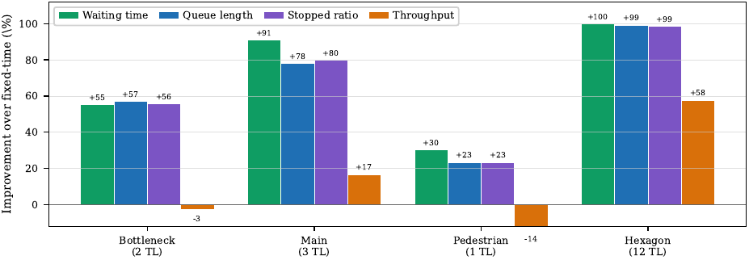
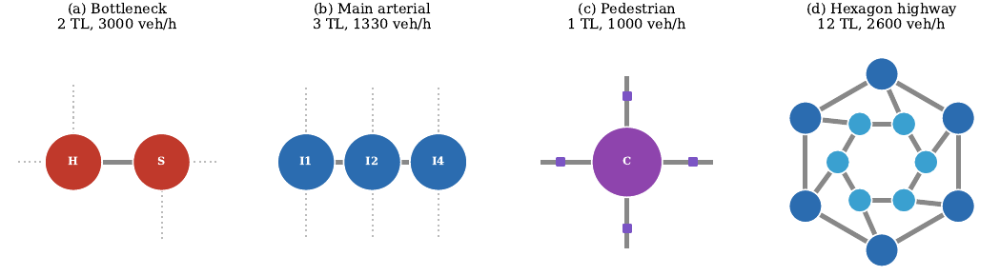
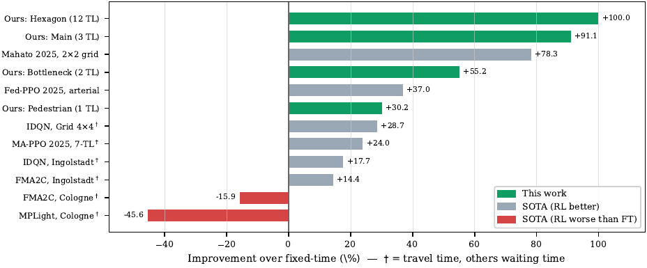

<div align="center">

# MARL-ATSC: PPO for Adaptive Traffic Signal Control on Baku Networks

**A composite-reward Proximal Policy Optimization controller and an open benchmark suite (BakuTSC) for adaptive traffic signal control in SUMO.**

[](https://www.python.org/)
[](https://www.eclipse.org/sumo/)
[](https://stable-baselines3.readthedocs.io/)
[](LICENSE)



</div>

---

## Overview

Fixed-time signals waste capacity when demand shifts, and recent benchmark studies
show that reinforcement-learning (RL) controllers can actually do *worse* than the
timers they replace. This project makes two contributions:

1. **BakuTSC** — an open suite of four SUMO benchmarks built from real Baku,
   Azerbaijan road geometry, deliberately chosen to isolate distinct control
   regimes (pedestrian trade-off, ramp-metering, arterial coordination, and
   large multi-agent scale) behind one evaluation protocol.
2. **A composite-reward PPO controller** — a single shared policy with a reward
   that couples waiting time, queue length, stopped ratio, throughput, load
   balance, and phase starvation, stabilized with observation/reward
   normalization and a best-checkpoint guard against late-training collapse.

Over full demand episodes the controller cuts mean waiting time by **30–100%**
against a matched fixed-time baseline and never increases delay, queues, or
stops — in pointed contrast to the negative results reported for single-term RL
baselines on real corridors.

## The BakuTSC Benchmark Suite

<div align="center">

</div>

| Scenario       | TLs | Demand (veh/h) | What it tests                                   |
|----------------|:---:|:--------------:|-------------------------------------------------|
| **Pedestrian** |  1  |     1 000      | Vehicle throughput vs. pedestrian-crossing delay |
| **Bottleneck** |  2  |     3 000      | Ramp-metering at a single-lane squeeze          |
| **Main**       |  3  |     1 330      | Green-wave coordination on an arterial          |
| **Hexagon**    | 12  |     2 600      | Multi-agent scale (156-dim observation)         |

Each scenario ships with calibrated demand, fixed evaluation seeds (5–10), and a
matched-snapshot evaluation protocol so methods can be compared on equal terms.

## Results (best checkpoint, full-episode 1000/100 protocol)

| Scenario   | Waiting time | Queue length | Stopped ratio | Throughput |
|------------|:-----------:|:------------:|:-------------:|:----------:|
| Bottleneck |   +55.2%    |    +57.0%    |    +56.0%     |   −2.8%    |
| Main       |   +91.1%    |    +77.9%    |    +75.0%     |  +16.6%    |
| Pedestrian |   +30.2%    |    +23.3%    |    +23.0%     |  −14.0%    |
| Hexagon    |  +100.0%    |    +99.4%    |    +98.0%     |  +57.8%    |

Positive = better than fixed-time. Throughput is intentionally traded on the
pedestrian junction (serving crossings) and the metered bottleneck. See the
[paper](paper/) for the full protocol, per-seed robustness, and a comparison
against 2025–2026 state-of-the-art methods.

<div align="center">

</div>

## Repository layout

```
.
├── envs/                  # Gymnasium SUMO environment + scenario configs
│   ├── baku_sumo_env.py   #   BakuSUMOEnv (TraCI), 10s decisions, composite reward
│   ├── trimmed_env.py     #   trims obs/action to the active TL count
│   └── scenario_configs.py
├── baselines/fixed_time.py# fixed-time runner (the baseline)
├── rewards/reward_fn.py   # composite reward weights (thesis Eq. 1)
├── scenarios/             # the four SUMO networks (.net/.rou/.sumocfg)
├── models/                # trained PPO checkpoints + VecNormalize stats
├── train.py               # PPO training (SubprocVecEnv + VecNormalize)
├── evaluate.py            # matched-snapshot multi-seed evaluation
├── evaluate_stepwise.py   # step-by-step single-seed eval with live readout
├── generate_site_data.py  # per-step metrics  -> website/data + paper data
├── generate_anim_data.py  # per-vehicle SUMO positions -> website animation
├── benchmark_compare.py   # our results vs. 2025–2026 SOTA
├── repro.py               # seeding / reproducibility manifest
├── paper/                 # AICT 2026 IEEE manuscript (LaTeX + figures)
├── website/               # static results & animation site (no build step)
├── logs/console/          # training / evaluation console logs
└── tests/                 # pytest suite
```

## Installation

Requires [Eclipse SUMO 1.18+](https://www.eclipse.org/sumo/) with `SUMO_HOME` set.

```bash
git clone https://github.com/abdullahkazimov/multi-agent-rl-atsc.git
cd multi-agent-rl-atsc
pip install -r requirements.txt
export SUMO_HOME=/usr/share/sumo      # adjust to your install
```

## Quickstart

```bash
# Train one scenario (PPO, 4 parallel SUMO workers)
python train.py --scenario main

# Evaluate the best checkpoint vs. fixed-time, all eval seeds
python evaluate.py --scenario main

# Watch a single run step-by-step (FT vs RL, live metric table)
python evaluate_stepwise.py --scenario hexagon --best

# Regenerate the website / paper data and the SOTA comparison
python generate_site_data.py --steps 1000 --warmup 100 --out-dir paper/data_1000
python benchmark_compare.py
```

## Interactive website

The `website/` folder is a self-contained static site (results dashboard,
per-scenario step-by-step charts, a live SUMO traffic animation, and the SOTA
comparison). No build step — just serve it:

```bash
cd website && python -m http.server 8000
# open http://localhost:8000
```

> **Note:** serve it over HTTP as above — opening `index.html` directly as a
> `file://` URL will show "Could not load data", because browsers block
> JavaScript from `fetch()`-ing local files.

## Paper

The AICT 2026 manuscript lives in [`paper/`](paper/) (IEEE two-column LaTeX).

```bash
cd paper && pdflatex paper && bibtex paper && pdflatex paper && pdflatex paper
```

If you use BakuTSC or this controller, please cite:

```bibtex
@inproceedings{kazimov2026ppo,
  title     = {Proximal Policy Optimization for Adaptive Traffic Signal
               Control on Baku Networks},
  author    = {Kazimov, Abdullah},
  booktitle = {Proc. IEEE Int. Conf. Application of Information and
               Communication Technologies (AICT)},
  year      = {2026},
  note      = {to appear}
}
```

## Data availability

The full BakuTSC materials — SUMO networks, calibrated demand, evaluation seeds,
trained policies, and the scripts that reproduce every table and figure — are
included in this repository. The accompanying paper will appear at AICT 2026.
For questions, contact the author.

## Author

**Abdullah Kazimov** — School of IT and Engineering, ADA University, Baku, Azerbaijan
· `akazimov14095@ada.edu.az`

Released under the [MIT License](LICENSE).
